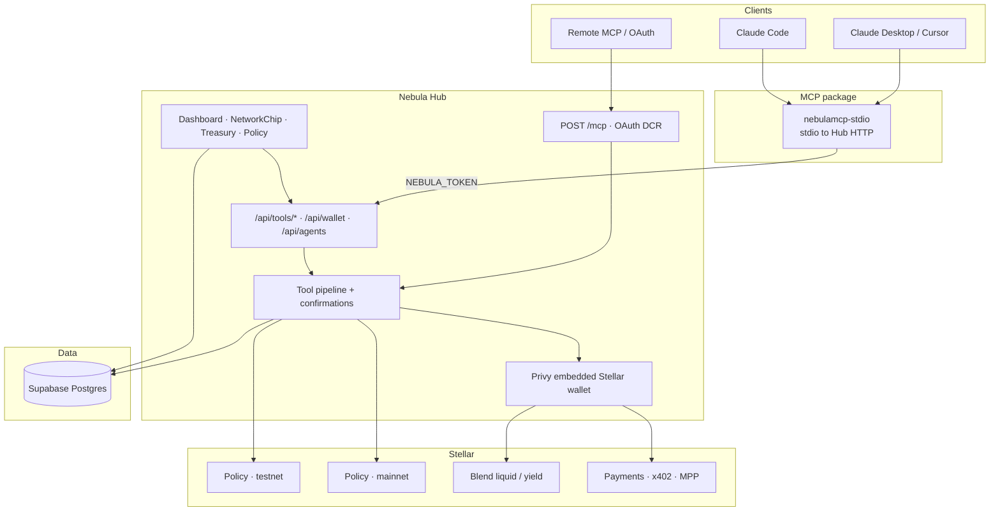

# Architecture

Nebula is a custody Hub for AI agents on Stellar. Agents never hold private keys. They authenticate with a `nbl_live_…` token (or OAuth) and call tools. The Hub enforces policy, confirms when required, signs via Privy, and submits to Stellar.

## Layers

| Layer | Role |
| --- | --- |
| **Hub** | Privy auth and custody, treasury/policy UI, tool APIs, remote Streamable HTTP MCP |
| `nebulamcp-core` | Shared Zod tool schemas and confirmation / policy matrix |
| `nebulamcp-stdio` | Thin stdio MCP client that forwards to the Hub (`npx nebulamcp-stdio`) |
| **Landing** | Marketing site, served with the Hub deploy |
| **Policy contract** | Shared multi-tenant Soroban policy; one deploy per ledger (testnet and mainnet) |

## Request path

1. An agent calls a tool over stdio MCP or remote `POST /mcp`.
2. The Hub authenticates the token (or OAuth) and loads that agent's wallet and policy for its network.
3. Policy and optional human confirmation run before signing.
4. Privy signs; the Hub submits to Stellar (payments, Blend, policy contract as needed).
5. State and history land in Postgres, scoped by network.

Private keys never leave the Hub. Clients only present `nbl_live_…` or OAuth.

For the simpler tool-call walkthrough, see [How it works](/concepts/how-it-works). For host and twin-ledger details, see [Networks](/networks).