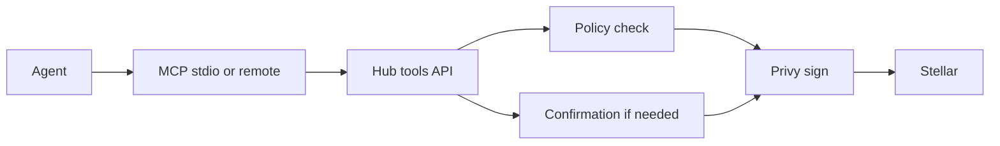

# How it works

1. Your agent calls a Nebula tool over MCP (local `nebulamcp-stdio` or remote `POST /mcp`).
2. The Hub authenticates the `nbl_live_…` token (or OAuth) and loads that agent's wallet and policy for its network.
3. Policy runs (caps, allow/deny, pause). Some actions return `confirmation_required` until you approve in the dashboard.
4. The Hub signs with Privy custody and submits to Stellar. The agent never sees a secret key.

Dashboard-only actions (policy writes, Blend deposit/withdraw, liquidity threshold) require your Hub login. Agents cannot call them via MCP.

See [Custody](/concepts/wallet-custody), [Spending policy](/concepts/spending-policy), and [Confirmations](/concepts/confirmations).